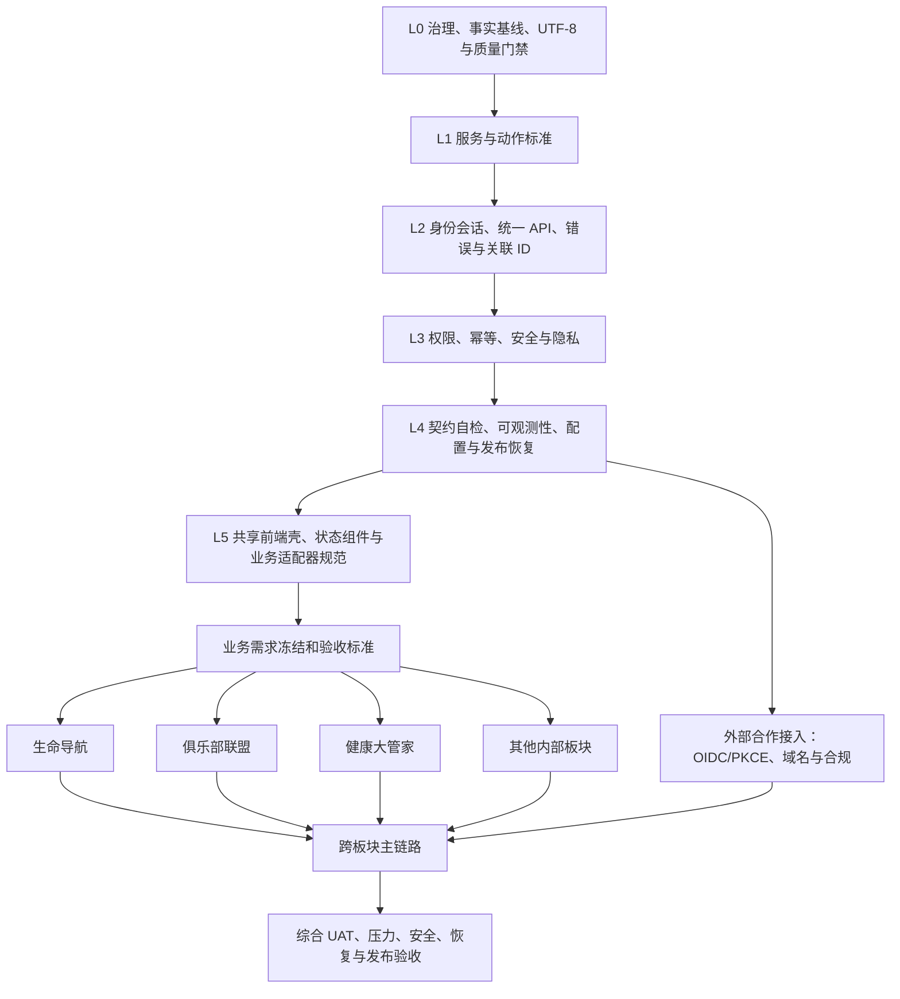

# 和奥堂 APP 依赖驱动开发总计划 v1

## 1. 排序原则

本计划不按页面数量或板块名称排序，而按“后续工作是否依赖前置能力”排序。只有前置门禁通过，依赖它的工作才能进入正式开发；互不依赖的工作在门禁通过后并行。

根问题规则继续有效：发现前置能力有缺陷时，暂停受影响的下游工作，修复根因并完成回归后再继续，不得以临时模拟、关闭校验或复制一套实现绕过。

## 2. 总依赖关系

## 3. 必须串行的关键路径

| 顺序 | 层级 | 交付内容 | 下游为什么依赖它 | 完成门禁 | 当前状态 |
| ---: | --- | --- | --- | --- | --- |
| 1 | L0 | ADR、Owner/RACI、事实台账、UTF-8、Git/CI 基线 | 没有统一规则，所有后续结果不可复核 | 编码门禁、决策记录、Handoff 模板可执行 | 已完成 |
| 2 | L1 | `service-plaza.v1`、`service-plaza.action.v1`、20 动作、9 服务目录 | 决定所有板块从哪里进入、如何返回和如何升级版本 | Schema、前后端、公开文件和测试环境逐字段一致 | 已完成 |
| 3 | L2 | 统一登录/会话、API SDK、错误信封、机器码、超时/取消、请求关联 ID | 每个业务都需要身份、请求和可诊断错误 | v1 信封严格；认证/网络/超时/取消有稳定码；请求可串联 | 已完成并部署 |
| 4 | L3 | scope 权限、原子幂等、安全边界、用户归属和敏感数据隔离 | 没有这些能力，业务写入可能重复、越权或泄露 | 权限默认拒绝；三项写入并发重放通过；跨用户隔离通过 | 已完成并部署 |
| 5 | L4 | 接入方自检、契约测试、功能开关、结构化日志、动作遥测、备份/回滚/恢复 | 板块并行后必须能独立验证、定位和安全发布 | CI 拒绝破坏性变更；发布失败可回滚；一次动作可追踪 | 已完成内部板块底座 |
| 6 | L5 | 共享 APP 壳、登录/空/错/无权限/维护状态、统一动作执行器、API 适配器模板 | 防止每个板块重复实现界面状态和基础交互 | 新板块只配置 Manifest/Action 和业务适配器即可接入 | 已完成内部板块底座 |
| 7 | R | 每个板块需求基线、数据模型、接口清单、验收案例、非目标 | 基础设施稳定不等于业务需求已经确定 | 需求、非目标、数据责任、验收人签入同一基线 | 三大板块第一切片已冻结，后续切片继续逐项冻结 |
| 8 | B | 各板块独立业务开发 | 只依赖稳定公共层和已冻结需求 | 板块自动化测试、安全门禁和测试环境 UAT 通过 | 第一切片准入完成，等待项目负责人协调首个板块 |
| 9 | X/U | 跨板块流程、综合验收和发布准备 | 验证组合后没有权限、状态、性能和回滚缺口 | 主链路、压力、安全、备份恢复和 Handoff 全部通过 | 等待上游 |

## 4. 所有业务的共同依赖

任何业务板块进入正式开发前，必须具备：

1. 已登记的服务 Manifest 和页面 Action。
2. 统一身份会话；外部服务使用 OIDC Authorization Code + PKCE，不在 URL 传平台 JWT。
3. 统一 API SDK，不自行复制 token、超时、重试和错误解析。
4. 统一成功/失败信封、机器错误码和 `X-Request-ID`。
5. 写接口使用原子 `Idempotency-Key`；同键异载荷必须冲突拒绝。
6. scope 和资源归属双重权限检查；前端判断不能替代后端授权。
7. 结构化日志、健康/就绪检查、动作事件和敏感字段脱敏。
8. 契约自检、单元/契约/集成测试、测试环境 UAT。
9. 备份、部署、回滚和恢复证据。
10. 已冻结的业务需求、数据责任、隐私等级和验收标准。

## 5. 各业务板块的专属依赖

| 板块 | 除共同依赖外的专属前置项 | 可开始正式业务开发的条件 |
| --- | --- | --- |
| 生命导航 | 维度定义、评估/记录模型、生命周期、隐私等级、后续服务转介规则 | 数据模型与非目标冻结；幂等记录创建和用户归属通过 |
| 俱乐部联盟 | 俱乐部类型、成员/角色、申请审核、管理 scope、分类筛选规则 | `club:manage` 权限来源验证；申请创建/重放/冲突语义通过 |
| 健康大管家 | 健康数据最小化、咨询归属、医生/用户权限、AI 使用边界和审计 | 敏感数据隔离、幂等、审计与脱敏专项验收通过 |
| 活动广场 | 活动状态、报名容量、取消规则、通知 | 活动模型和并发容量规则冻结 |
| 人脉中心 | 关系建立、同意/撤回、可见范围、反骚扰 | 双向同意和隐私可见性模型冻结 |
| 保障商城 | 商品责任方、库存、订单、支付、退款、对账 | 支付安全、资金状态机、回调验签和对账门禁独立通过 |
| 二手集市 | 发布审核、交易责任、举报、内容安全 | 内容审核和交易责任边界冻结 |
| AI 助手 | 模型供应商、提示词治理、数据许可、成本、失败降级 | 敏感数据许可、审计、限额和人工兜底通过 |
| 学习广场 | 课程目录、学习进度、内容版权、评价 | 内容授权和进度模型冻结 |
| 外部合作服务 | Provider、HTTPS 域名白名单、OIDC/PKCE、数据处理协议、SLA、退出方案 | 外部接入安全和合规验收通过后才能从 preview 转 active |

## 6. 并行规则

- L2 可以并行实现认证、API SDK 和关联 ID，但必须在 L3 联调前统一信封与错误码。
- L3 中权限、幂等和安全审计可以并行，但任何一项未通过都不能开放板块写入。
- L4 的契约工具、可观测性和发布恢复可以并行建设。
- 在 L1 至 L4 未完成前，各板块只能整理资料、澄清需求、编写契约适配器和测试案例，不得把未确定业务逻辑写入公共层。
- L1 至 L5 通过且对应业务需求 R 通过后，生命导航、俱乐部联盟、健康大管家可以由独立负责人并行开发。
- 商城支付、健康敏感数据、外部合作接入即使公共层通过，也必须增加各自专项门禁。

## 7. 当前执行批次

### 批次 A：关闭公共主链路

1. 部署并验证 v1 认证信封、真实 scopes 和原子验证码消费。
2. 部署并验证统一关联 ID、CORS、严格 API SDK。
3. 完成生命导航、俱乐部申请、健康咨询的原子幂等与并发测试。
4. 完成动作运行时权限预检；内部入口允许进入登录/无权限承接页，外部/OIDC/平台命令无受控处理器时默认拒绝。

### 批次 B：形成板块并行底座

1. 完成接入方自检工具和 CI 示例。
2. 完成结构化日志、动作遥测、功能开关和配置默认值。
3. 完成备份恢复演练和发布失败回滚演练。
4. 固化共享页面状态和业务适配器模板。

状态：已于 2026-07-10 完成。备份恢复与部署失败自动回滚均已真实演练；回滚演练发现并修复了直接覆盖运行中二进制导致的权限竞态。

### 批次 C：冻结业务并行开发

1. 生命导航需求和验收标准冻结。
2. 俱乐部联盟需求和验收标准冻结。
3. 健康大管家需求和验收标准冻结。
4. 三个板块独立开发、独立测试、统一接入。

状态：前三项第一切片已于 2026-07-10 形成契约和两层依赖图，`development_readiness=go`、`acceptance_readiness=partial-go`。尚未进入具体业务代码切片；按项目负责人要求，在阶段切换前先通知并协调首个板块。

### 批次 D：第一阶段综合验收

1. 登录—服务广场—核心服务—提交—结果—返回完整主链路。
2. 未登录、无权限、重复提交、跨用户、超时、下线和恢复场景。
3. 安全、压力、备份恢复、部署回滚和 Handoff。
4. 所有 P0/P1 问题关闭后形成第一阶段 Go/No-Go 结论。

## 8. 计划维护规则

- 本文件是总排序依据；具体实现状态记录在各阶段计划和 Handoff，不另建冲突台账。
- 前置依赖或业务范围改变时，先更新 ADR/本计划，再调整下游排期。
- “代码存在”不等于完成；只有自动化测试、测试环境行为和验收证据同时满足才可更新为已完成。
